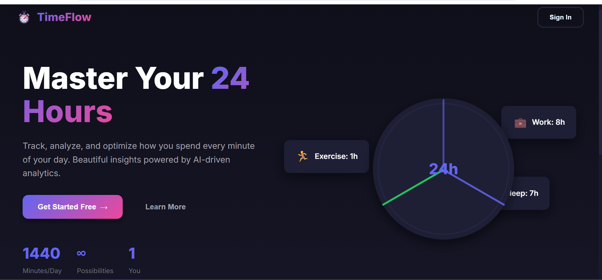
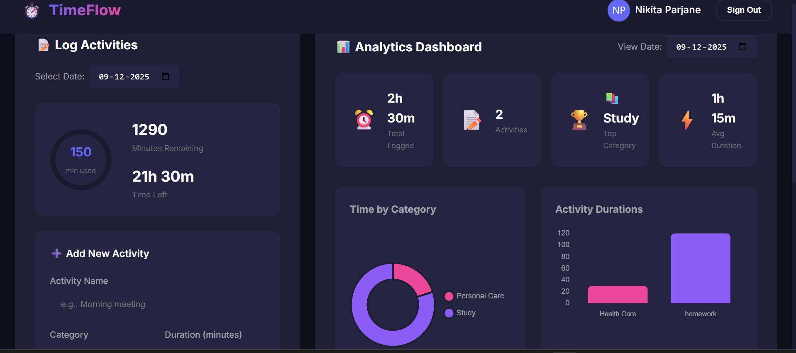
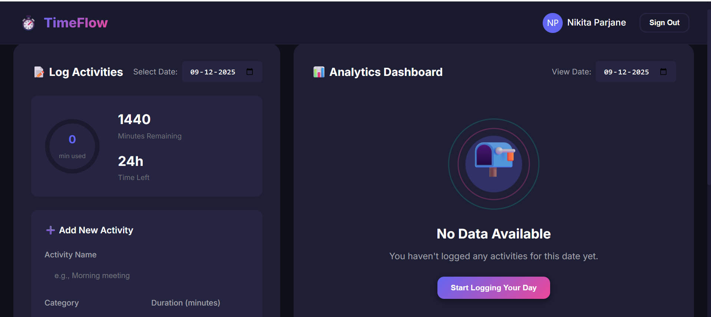

# ⏱️ TimeFlow - AI-Powered Daily Time Tracking

**A beautiful, responsive web application for tracking and analyzing how you spend your 24 hours each day.**

[](https://github.com/Nikita-Parjane27/TimeFlow-Analytics)
[](LICENSE)
[Live Demo](https://github.com/Nikita-Parjane27/TimeFlow-Analytics) 
• [Video Walkthrough](https://youtube.com/watch?v=xxxxx) 
• [Report Bug](https://github.com/Nikita-Parjane27/TimeFlow-Analytics/issues) 
• [Request Feature](https://github.com/Nikita-Parjane27/TimeFlow-Analytics/issues)

---

## 🌟 Overview

**TimeFlow** helps you gain insights into your daily routines by tracking activities throughout the day. With powerful analytics, beautiful visualizations, and seamless cloud synchronization, TimeFlow makes time management intuitive and engaging.

### Why TimeFlow?

- 📊 **Data-Driven Insights** - Visualize your time distribution with interactive charts
- 🔄 **Cross-Device Sync** - Access your data anywhere with Firebase cloud storage
- 🎯 **User-Friendly** - Clean, intuitive interface that's easy to navigate
- 🔒 **Secure** - Protected with Firebase Authentication
- 📱 **Responsive** - Perfect experience on any device

---

## ✨ Features

- 🔐 **Secure Authentication**  Email/Password and Google Sign-in 
- 📝 **Activity Logging**  Track multiple activities per day 
- 📊 **Analytics Dashboard**  Pie charts, bar charts, timeline visualizations 
- 📱 **Fully Responsive**  Works on mobile, tablet, and desktop
- 🎨 **Beautiful UI**  Modern dark theme with smooth animations 
- ☁️ **Cloud Sync**  Data synced across all devices via Firebase 
- ⚡ **No Data State**  User-friendly illustration/message when no data is logged 

---

## 🛠️ Tech Stack
- **Frontend**: HTML5, CSS3, Vanilla JavaScript
- **Backend/Database**: Firebase (Firestore + Authentication)
- **Deployment**: GitHub Pages and Netlify
### Libraries
- **Chart.js** - Interactive data visualizations
- **Firebase SDK** - Authentication and Firestore database

### Deployment
![GitHub Pages] (https://nikita-parjane27.github.io/TimeFlow-Analytics/)

---

## 📸 Screenshots

### 🏠 Landing Page

*Clean, welcoming landing page with clear call-to-action*

### 📊 Dashboard

*Activity logging interface with real-time updates*

### 📈 Analytics

*Beautiful charts and visualizations of your time data*

### 🎯 No Data State

*Friendly empty state encouraging users to start logging*

---

## 🚀 Getting Started

### Prerequisites

- Modern web browser (Chrome, Firefox, Safari, Edge)
- Git installed on your machine
- Firebase account (free tier works perfectly)
- Code editor (VS Code recommended)

### Installation

1. **Clone the repository**
   ```bash
   git clone https://github.com/Nikita-Parjane27/TimeFlow-Analytics
   cd timeflow

2. **Install dependencies (if any)**
- Vanilla JS project: no installation needed
- If using a local dev server (like Live Server extension in VS Code), start it

3. **Set up Firebase**
- Add your Firebase configuration in src/js/firebase-config.js
- Make sure Firestore rules and Authentication are enabled

4. **Run the project**
- Open index.html in your browser, or serve via a local dev server

### 📈 Future Improvements

- AI-generated personalized suggestions for optimizing daily schedule
- Multi-day timeline visualization
- Export analytics reports as PDF
- Dark/light theme toggle
- Optional user settings & notifications
